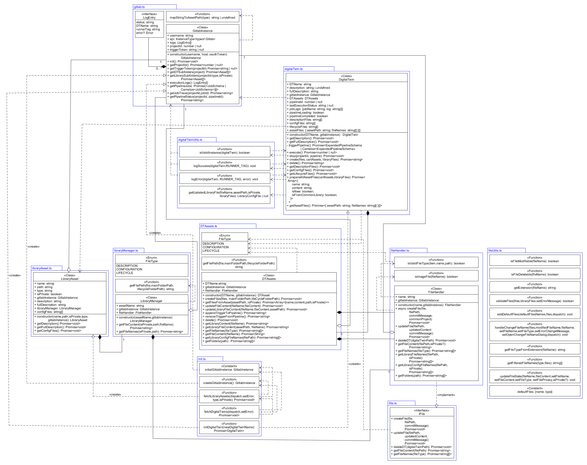

# Backend Architecture Documentation

## Overview

This document describes the software architecture related to communicating with
the backend. It is designed to support various commonly used services for storage
and/or execution, with the flexibility to easily add new ones. In short, the goal
is to have a high degree of flexibility.

## Core Architecture Patterns

We apply interfaces, the builder pattern, and dependency injection to realize this
abstraction - essentially implementing the Strategy pattern. Hence, each
`DigitalTwinAsset`, `DigitalTwin`,etc. has a core backend and its associated
backend APIs (for e.g. REST execution with GitLab) that is chosen upon creation
through the use of a builder. This allows any backend or backend API to be used
interchangeably and swapped at runtime, supporting CI. Here is an example of how
the backends are connected to key objects:

```typescript
  // Constructor with backend injected
  constructor(name: string, backend: BackendInterface) {
    this.name = name;
    this.backend = backend;
  }
  ...
  // Calling backend for project info
  const projectToUse = commonProject
      ? this.backend.getCommonProjectId()
      : this.backend.getProjectId();
  // Calling backend's api for creating a file in project
  await this.backend.api.createRepositoryFile(
      projectToUse,
      `${filePath}/${file.name}`,
      'main',
      file.content,
      commitMessage,
  );
```

## Key Components

### Instance

The Instance is responsible for linking the DTaaS application to the selected backend.
This entails keeping track of logs, project ids and keeping associated backend API
instances for further operations as described below. The interface is described in
`./UtilInterfaces.ts` with a concrete implementation being `./instance.ts`. It is
either created on an instance basis or passed from instance to instance when
creating other instances. These then use the enriched project information to
execute API commands, as demonstrated above. Detailed Logs are kept for any
Digital Twin executions, describing the success and job processing.

### Backend

The Backend communicates directly with the backend server for pipeline execution,
log retrieval, and or file management. The interface is described in
`./UtilInterfaces.ts` with a concrete implementation being `./backend.ts`. It is
created before the Instance to be injected and may be initialized there. After
this, it may be called through the Instance  directly (e.g.
`myInstance.api.cancelPipeline(...)`). It may contain a client field from a
library such as GitBeaker to manage communication with REST-API.

### 1. Interface Layer

#### What interfaces exist and their purpose

1. **`Backend`**: Communicates with server
1. **`Instance`**: Maintains data received from server

Interfaces for contract and documentation only:

1. **`DigitalTwinInterface`**
1. **`DTAssetsInterface`**
1. **`FileHandlerInterface`**
1. **`LibraryAssetInterface`**
1. **`LibraryManagerInterface`**

#### What types are defined

The system defines several types to support the backend-agnostic architecture.
Here is an overview:

**Core API Response Types**
These types represent the standardized data structures returned by different
backend APIs. Example:

* **`ProjectId`**: Flexible project identifier supporting different backend ID formats

```typescript
type ProjectId = number | string;
```

**Logging and Execution Types**
These types support execution tracking and debugging. Example:

* **`LogEntry`**: Execution log entries of pipeline executions, including status,
name and runner tag.

```typescript
type LogEntry = {
  status: string;
  DTName: string;
  runnerTag: string;
  error?: Error;
};
```

**Digital Twin State Management Types**
These types manage the complex state of digital twin instances. Example:

* **`DigitalTwinPipelineState`**: Detailed pipeline execution state and job tracking

```typescript
type DigitalTwinPipelineState = {
  pipelineId: number | null;
  lastExecutionStatus: ExecutionStatus | null;
  jobLogs: JobLog[];
  pipelineLoading: boolean;
  pipelineCompleted: boolean;
};
```

**File Management Types**
These types handle file operations and state tracking. Example:

* **`FileState`**: Comprehensive file state tracking with modification flags

```typescript
type FileState = {
  name: string;
  content: string;
  isNew: boolean;
  isModified: boolean;
  type?: string;
  isFromCommonLibrary?: boolean;
};
```

**Library Asset Types**
These types manage reusable asset components. Example:

* **`LibraryAssetFiles`**: Asset file organization with privacy controls. Example:

```typescript
type LibraryAssetFiles = {
  path: string;
  type: string;
  isPrivate: boolean;
  configFiles: string[];
};
```

#### Why these particular abstractions were chosen

The type system is designed around these principles:

1. **Backend Agnosticism**: Types like `ProjectId` support both numeric and string
identifiers, allowing compatibility with different backend systems (GitLab uses
numbers, GitHub uses strings).

1. **SOLID**: Complex state types like `DigitalTwinPipelineState` expose all
necessary execution information while maintaining clear boundaries between
different concerns, and only that functionality. The Liskov substitution
principle is particularly important for the sake of dependency injection.
It further allows the codebase to depend only on relevant subsets of interfaces,
enabling easier testing, clearer separation of concerns, and greater reusability
of functionality.

### 2. Implementation Layer

Currently, Gitlab is the sole backend that has been implemented, but
implementation should not differ drastically between common backends (GitHub, Azure).

### 3. Factory Layer

To use a different backend, the builder's dependency injection must be updated
to provide the desired backend implementation.

## Data Flow

The below class diagram shows how a backend (Gitlab) is used.


## Extension Points

To expand on the backend support, you must create a file for both the API and
the data holding backend implementing their respective interfaces.
Below is a detailed guide:

### Adding a New Backend Provider

1. Implement Backend (Instance) and BackendAPI (Backend) interfaces in 2 files
1. Modify the backend builder to use the new backend.
1. Add both unit and integration tests for these files.
1. Create and place new backends inside `src/model/backend/[YOUR BACKEND'S NAME]`
folder.
1. Name as [`backend name`] and [`backend name`]API respectively.

### Extending Existing Functionality

To extend general backend capabilities, update the `./UtiliyInterfaces.ts` file.
Otherwise, just implement it on a class level. Consider SOLID principles in this
process.
