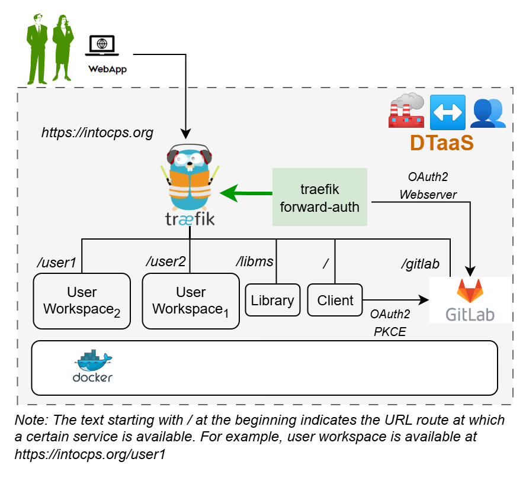

<!-- markdownlint-disable MD041 -->


Thank you for downloading **Digital Twin as a Service**.

This README provides a quick-start installation guide for a secure,
multi-user DTaaS deployment that uses an **integrated GitLab instance**
for OAuth 2.0 authorisation.

This README provides a quick-start installation guide. For detailed
configuration reference, see [CONFIG.md](CONFIG.md).

> [!IMPORTANT]
> The hostname `intocps.org` is used for illustration throughout
> this guide. Replace it with the actual server hostname of the
> installation.

## :globe_with_meridians: Overview

This package installs the DTaaS as a multi-user web application with an
integrated GitLab CE instance. GitLab serves as both the OAuth 2.0
authorisation provider and the DevOps backend for digital twin projects.



The `docker-compose.yml` starts the following services:

| Service | Purpose |
| :--- | :--- |
| **traefik** | Reverse proxy with TLS termination |
| **client** | DTaaS React frontend |
| **user1 / user2** | JupyterLab user workspaces |
| **libms** | Library management microservice |
| **traefik-forward-auth** | OAuth 2.0 authorisation middleware |
| **gitlab** | Integrated GitLab CE (OAuth 2.0 provider) |

## :clipboard: Prerequisites

| Requirement | Details |
| :--- | :--- |
| **Docker Engine** | v28 or later with Compose plugin |
| **Domain name** | A domain name (e.g. `intocps.org`) or IP address |
| **TLS certificate** | `fullchain.pem` and `privkey.pem` for the domain. Obtain via [certbot](https://certbot.eff.org/) or a certificate provider |

## :rocket: Quick Start

### 1. Create Configuration Files

```bash
cp config/.env.example       config/.env
cp config/conf.server.example config/conf.server
cp config/client.js.example     config/client.js
```

Edit `config/.env` — set `SERVER_DNS`, `USERNAME1`, `USERNAME2`.
Leave the `OAUTH_*` variables as placeholders for now; they will be
filled after the GitLab instance is running (see step 5).

See [CONFIG.md](CONFIG.md) for a complete reference of every variable.

### 2. Create User Workspace Directories

```bash
cp -R files/template files/<USERNAME1>
cp -R files/template files/<USERNAME2>
sudo chown -R 1000:100 files/*
```

### 3. Add TLS Certificates

```bash
cp /path/to/fullchain.pem certs/fullchain.pem
cp /path/to/privkey.pem   certs/privkey.pem
```

Traefik falls back to self-signed certificates if these files are
absent or invalid.

### 4. Start Services

```bash
docker compose --env-file config/.env up -d
```

Wait a few minutes for GitLab to become healthy:

```bash
watch docker ps
```

### 5. Configure GitLab :fox_face:

Once the GitLab container shows as `healthy`:

1. Log in to `https://intocps.org/gitlab` as `root`.
   The initial password is inside `config/gitlab/initial_root_password`.

   > [!WARNING]
   > This file is **deleted 24 hours** after the first start.
   > Save the password immediately.

1. Create user accounts (see
   [GitLab docs](https://docs.gitlab.com/ee/user/profile/account/create_accounts.html)).
   The usernames **must** match `USERNAME1`/`USERNAME2` in `config/.env`.

1. Register two OAuth 2.0 applications in GitLab
   (Admin Area → Applications):

   - **DTaaS Client Authorization** — for the React SPA frontend.
     See [client auth docs](https://into-cps-association.github.io/DTaaS/development/admin/client/auth.html).
   - **DTaaS Server Authorization** — for Traefik forward-auth backend.
     See [server auth docs](https://into-cps-association.github.io/DTaaS/development/admin/servers/auth.html).

1. Update configuration files (`config/.env` and `config/client.js`) with
   the generated OAuth 2.0 tokens:
   - Set `REACT_APP_CLIENT_ID` and `REACT_APP_AUTH_AUTHORITY` in
     `config/client.js`.
   - Set `OAUTH_URL`, `OAUTH_CLIENT_ID`, and `OAUTH_CLIENT_SECRET` in
     `config/.env`.

1. Update user permissions in `config/conf.server`.

1. Reload the services:

   ```bash
   docker compose --env-file config/.env up -d --force-recreate client traefik-forward-auth
   ```

### 6. Verify :white_check_mark:

| URL | Expected result |
| :--- | :--- |
| `https://intocps.org` | DTaaS web interface (redirects to GitLab sign-in) |
| `https://intocps.org/gitlab` | Integrated GitLab instance |
| `https://intocps.org/user1` | User 1 workspace (after sign-in) |
| `https://intocps.org/user2` | User 2 workspace (after sign-in) |

## :stop_sign: Stop

```bash
docker compose --env-file config/.env down
```

## :file_folder: Directory Layout

```text
.
├── certs/                 # TLS certificates (fullchain.pem, privkey.pem)
├── config/
│   ├── .env               # Docker compose environment variables
│   ├── conf.server        # Traefik forward-auth authorisation rules
│   ├── client.js             # DTaaS React client configuration
│   ├── gitlab/            # GitLab config (mounted as /etc/gitlab)
│   └── tls.yml            # Traefik TLS provider configuration
├── data/                  # GitLab persistent data (/var/opt/gitlab)
├── files/
│   ├── common/            # Shared files across all workspaces
|  \- template/           # sample user workspace files
├── logs/                  # GitLab logs (/var/log/gitlab)
├── docker-compose.yml     # Service definitions
├── CONFIG.md              # Detailed configuration reference
└── README.md              # This file — quick-start guide
```

## :book: Administration Summary

The full DTaaS documentation is available at
<https://into-cps-association.github.io/DTaaS/>.
The sections relevant for administrators are summarised below.

| Topic | Description |
| :--- | :--- |
| [Installation overview](https://into-cps-association.github.io/DTaaS/development/admin/overview.html) | Comparison of all installation setups (localhost, server, vagrant, packages) |
| [Client configuration](https://into-cps-association.github.io/DTaaS/development/admin/client/config.html) | All React client `client.js` variables explained |
| [Client OAuth 2.0](https://into-cps-association.github.io/DTaaS/development/admin/client/auth.html) | Creating the OAuth 2.0 application for the React frontend |
| [Server OAuth 2.0](https://into-cps-association.github.io/DTaaS/development/admin/servers/auth.html) | Creating the OAuth 2.0 application for Traefik forward-auth |
| [GitLab installation](https://into-cps-association.github.io/DTaaS/development/admin/gitlab/index.html) | Setting up a local GitLab instance |
| [GitLab integration](https://into-cps-association.github.io/DTaaS/development/admin/gitlab/integration.html) | Connecting the GitLab instance to DTaaS as OAuth 2.0 provider |
| [Add / remove users](https://into-cps-association.github.io/DTaaS/development/admin/guides/add_user.html) | Step-by-step guide for managing user accounts on a running installation |
| [CLI tool](https://into-cps-association.github.io/DTaaS/development/admin/cli.html) | Command-line interface for managing a DTaaS installation |
| [Renew TLS certificates](https://into-cps-association.github.io/DTaaS/development/admin/guides/renew_certs.html) | Updating expired TLS certificates |

## :link: Documentation

Please see
<https://into-cps-association.github.io/DTaaS/development/index.html>
for complete documentation.

## :framed_picture: References

Image sources:
[Traefik logo](https://www.laub-home.de/wiki/Traefik_SSL_Reverse_Proxy_f%C3%BCr_Docker_Container),
[gitlab](https://gitlab.com)
