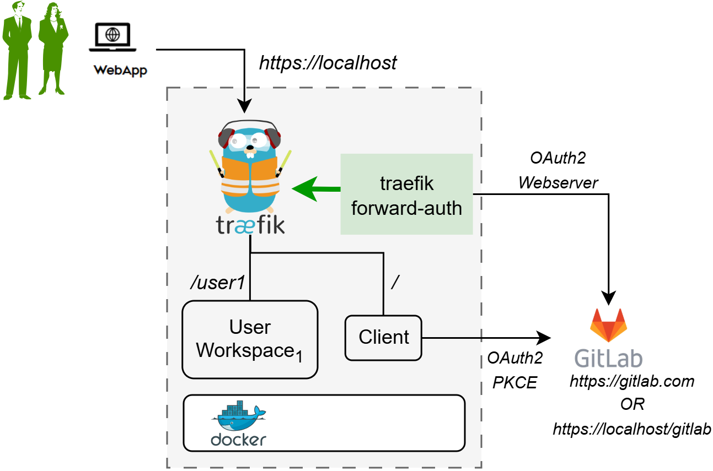

# Install DTaaS on localhost with GitLab Integration

This installation is suitable for single users intending to use
DTaaS on their own computers.

The installation instructions provided in this document are
appropriate for running the **DTaaS on localhost served over HTTPS connection**.
**The intention is to integrate GitLab into DTaaS so that both**
**are running on localhost.**

If GitLab running on localhost is not required,
the simpler [localhost setup](localhost.md) should be used.

## Design

An illustration of the docker containers used and the authorization
setup is presented here.



🗒️ The text starting with `/` at the beginning indicates the URL route
at which a certain service is available. For example, user workspace
is available at <https://localhost/user1>.

## Requirements

The installation requirements to run this docker version of the DTaaS are:

- docker desktop / docker CLI with compose plugin
- [mkcert](https://github.com/FiloSottile/mkcert)

## Clone Codebase

If the DTaaS git repository has not been cloned, cloning is
the first step.
If the codebase already exists, the cloning step can be skipped.
To clone:

```bash
git clone https://github.com/INTO-CPS-Association/DTaaS.git
cd DTaaS
```

:clipboard: file pathnames

1. The filepaths shown here follow POSIX convention.
   The installation procedures also work with Windows
   paths.
1. The description below refers to filenames. All the file
   paths mentioned below are relatively to the top-level
   **DTaaS** directory.

## Configure

### Create User Workspace

The existing filesystem for installation is configured for `user1`.
A new filesystem directory must be created for the selected user.

The following commands should be executed from the top-level directory
of the DTaaS project.

```bash
cp -R files/user1 files/username
```

where _username_ is the selected username to be created (in next steps)
on GitLab running at <https://localhost/gitlab>.

### Obtain TLS / HTTPS Certificate

[mkcert](https://github.com/FiloSottile/mkcert) can be used to generate
TLS certificates following
[this guide](https://kifarunix.com/create-locally-trusted-ssl-certificates-with-mkcert-on-ubuntu-20-04/).
The certificates should be generated for `localhost`.

The names of the certificates must be `fullchain.pem` and `privkey.pem`.
The `fullchain.pem` corresponds to public certificate and
the `privkey.pem` corresponds to private key.

### Add TLS Certificates to Traefik

Copy the two certificate files into:

- `deploy/docker/certs/localhost/fullchain.pem`
- `deploy/docker/certs/localhost/privkey.pem`

Traefik will run with self-issued certificates if the above two certificates
are either not found or found invalid.

### Docker Compose

The docker compose configuration is in `deploy/docker/.env.local`;
it is a sample file.
It contains environment variables
that are used by the docker compose files.
It can be updated to suit your local installation scenario.
It contains the following environment variables.

All fields should be edited according to the specific deployment case.

| URL Path      | Example Value           | Explanation                                                                        |
| :------------ | :---------------------- | :--------------------------------------------------------------------------------- |
| DTAAS_DIR     | '/Users/username/DTaaS' | Full path to the DTaaS directory. This is an absolute path with no trailing slash. |
| username1     | 'user1'                 | Your GitLab username                                                               |

:clipboard: Important points to note:

1. The path examples given here are for Linux OS.
   These paths can be Windows OS compatible paths as well.
1. The client configuration file is located at
   `deploy/config/client/env.local.js`.
   Edit the URLs in this file by replacing `http` with `https`.
   Beyond this, it is not necessary to modify this file.

## Run

### Start DTaaS to Integrate GitLab

The commands to start and stop the appliation are:

```bash
docker compose -f compose.local.secure.yml --env-file .env.local up -d
docker compose -f compose.local.secure.yml --env-file .env.local down
```

To restart only a specific container, for example `client`

```bash
docker compose -f compose.local.secure.yml --env-file .env.local up \
 -d --force-recreate client
```

### Start GitLab

Use the instructions provided in
[GitLab integration](gitlab/index.md) to bring up
GitLab on localhost and the GitLab service will be available at <https://localhost/gitlab>

### Register OAuth 2.0 Application

The frontend website requires OAuth 2.0 application registration on
the integrated GitLab.
The details of OAuth 2.0 application for the frontend website are available in
[client docs](client/auth.md).

The default OAuth 2.0 client application provided in `env.local.js` functions correctly.
However, when running an
[integrated GitLab instance](gitlab/index.md),
this application needs to be created on GitLab running at <https://localhost/gitlab>.

<https://localhost/Library> should be used as the Callback URL (`REACT_APP_REDIRECT_URI`).

The
[GitLab OAuth 2.0 provider](https://docs.gitlab.com/ee/integration/oauth_provider.html)
documentation provides further guidance on creating this OAuth 2.0 application.

### Update Client Website Configuration

Replace the contents of `deploy/config/client/env.local.js` with
the following.

```js
if (typeof window !== 'undefined') {
  window.env = {
    REACT_APP_ENVIRONMENT: 'local',
    REACT_APP_URL: 'https://localhost/',
    REACT_APP_URL_BASENAME: '',
    REACT_APP_URL_DTLINK: '/lab',
    REACT_APP_URL_LIBLINK: '',
    REACT_APP_WORKBENCHLINK_VNCDESKTOP: '/tools/vnc/?password=vncpassword',
    REACT_APP_WORKBENCHLINK_VSCODE: '/tools/vscode/',
    REACT_APP_WORKBENCHLINK_JUPYTERLAB: '/lab',
    REACT_APP_WORKBENCHLINK_JUPYTERNOTEBOOK: '',
    REACT_APP_WORKBENCHLINK_LIBRARY_PREVIEW: '/preview/library',
    REACT_APP_WORKBENCHLINK_DT_PREVIEW: '/preview/digitaltwins',

    REACT_APP_CLIENT_ID: 'xxxxxx',
    REACT_APP_AUTH_AUTHORITY: 'https://localhost/gitlab/',
    REACT_APP_REDIRECT_URI: 'https://localhost/Library',
    REACT_APP_LOGOUT_REDIRECT_URI: 'https://localhost/',
    REACT_APP_GITLAB_SCOPES: 'openid profile read_user read_repository api',
  };
};
```

And then update OAuth 2.0 client application ID (`REACT_APP_CLIENT_ID`) with that
of the newly registered OAuth 2.0 application.

### Restart DTaaS Client Website

To update the client website configuration, run

```bash
docker compose -f compose.local.secure.yml --env-file .env.local up \
  -d --force-recreate client
```

## Use

The application will be accessible at:
<https://localhost> from a web browser.
Users can sign in using their <https://localhost/gitlab> account.

All the functionality of DTaaS should be available
through the single page client.

## Limitations

The [library microservice](servers/lib/docker.md) is not
included in the localhost installation scenario.

## Docker Help

The commands to start and stop the appliation are:

```bash
docker compose -f compose.local.secure.yml --env-file .env.local up -d
docker compose -f compose.local.secure.yml --env-file .env.local down
```

To restart only a specific container, for example `client`

```bash
docker compose -f compose.local.secure.yml --env-file .env.local up \
  -d --force-recreate client
```

## References

Image sources:
[Traefik logo](https://www.laub-home.de/wiki/Traefik_SSL_Reverse_Proxy_f%C3%BCr_Docker_Container),
[ml-workspace](https://github.com/ml-tooling/ml-workspace),
[reactjs](https://krify.co/about-reactjs/),
[GitLab](https://gitlab.com)
