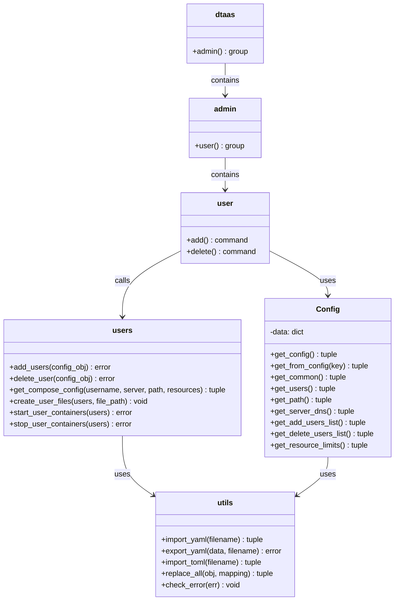
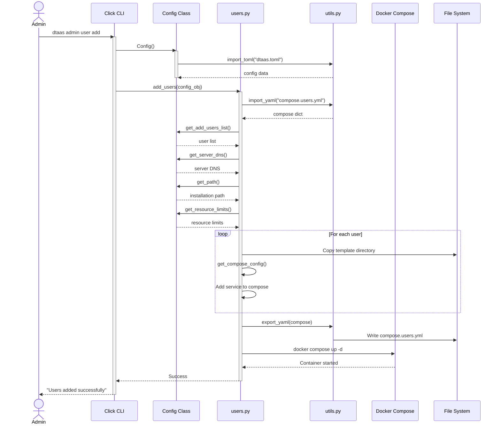

# Command Line Interface

The Command Line Interface (CLI) provides administrators with programmatic
control over the DTaaS platform. This administrative tool manages
provisioning and deprovisioning of user accounts.

## Package Structure

The CLI package is organized as follows:

```text
cli/
├── src/                           # Application source code
│   ├── __init__.py                # Package initialization
│   ├── cmd.py                     # Click command groups and handlers
│   └── pkg/                       # Package modules
│       ├── config.py              # Configuration management (TOML parsing)
│       ├── constants.py           # Constant definitions
│       ├── users.py               # User lifecycle operations
│       └── utils.py               # File I/O and utilities
├── tests/                         # Test suites
│   ├── test_cli.py                # CLI integration tests
│   ├── test_cmd.py                # Command handler tests
│   ├── test_config.py             # Configuration tests
│   ├── test_users.py              # User operations tests
│   ├── test_utils.py              # Utility function tests
│   └── data/                      # Test fixtures
├── examples/                      # Example configuration files
├── dtaas.toml                     # Default configuration file
├── users.local.yml                # Local deployment template
├── users.server.yml               # Server deployment template
├── users.server.secure.yml        # Secure server template
└── pyproject.toml                 # Poetry project configuration
```

## Architecture and Design

The CLI is implemented as a Python package using the Click framework for
command parsing. The design separates configuration management,
user operations, and utility functions into distinct classes and
utility functions.



### Key Modules

| Module      | Purpose                                              |
| :---------- | :--------------------------------------------------- |
| `cmd.py`    | Defines Click command groups and command handlers    |
| `config.py` | Configuration management via TOML file parsing       |
| `users.py`  | User lifecycle operations (add/delete)               |
| `utils.py`  | File I/O and template substitution utilities         |

### Configuration Module

The `Config` class serves as the central configuration manager, reading from
`dtaas.toml`. It provides accessor methods that return tuples of `(value, error)`,
following a Go-style error handling pattern that enables explicit error
propagation without exceptions.

Key configuration sections include:

- **common**: Server DNS, installation path, and resource limits
- **users**: Lists of users to add or delete

### User Operations Module

The user operations module manages the complete lifecycle of user workspaces:

1. **Workspace Creation**: Copies template directory structure for each user
2. **Container Configuration**: Generates Docker Compose service definitions
   with configurable resource limits (CPU, memory, shared memory, process limits)
3. **Container Orchestration**: Starts and stops user containers via
   Docker Compose commands

### Utility Functions

The utilities module provides:

- **YAML/TOML I/O**: Safe file reading and writing operations
- **Template Substitution**: Recursive placeholder replacement in nested
  data structures (strings, lists, dictionaries)
- **Error Checking**: Helper function for converting errors to exceptions

## Sequence Diagram

The following diagram illustrates the user addition workflow:



## Error Handling Pattern

The CLI employs a consistent error handling strategy throughout the codebase:

1. **Functions return errors as values**: Most functions return a tuple of
   `(result, error)` rather than raising exceptions
2. **Explicit error propagation**: Callers check for errors and propagate
   them up the call stack
3. **Click exceptions at boundaries**: At the CLI entry points, errors are
   converted to `click.ClickException` for user-friendly output

This pattern provides explicit control flow and facilitates testing by making
error paths explicit and testable.

## Resource Limits Configuration

The CLI supports configurable resource limits for user containers, enabling
administrators to control resource consumption per user and reduce
the possibility of a single user making excessive use of limited computing
resources. The default resource limits are:

| Parameter     | Description                      | Example Value |
| :------------ | :------------------------------- | :------------ |
| `shm_size`    | Shared memory size               | `512m`        |
| `cpus`        | CPU core allocation              | `2`           |
| `mem_limit`   | Memory limit                     | `2g`          |
| `pids_limit`  | Maximum process count            | `100`         |
