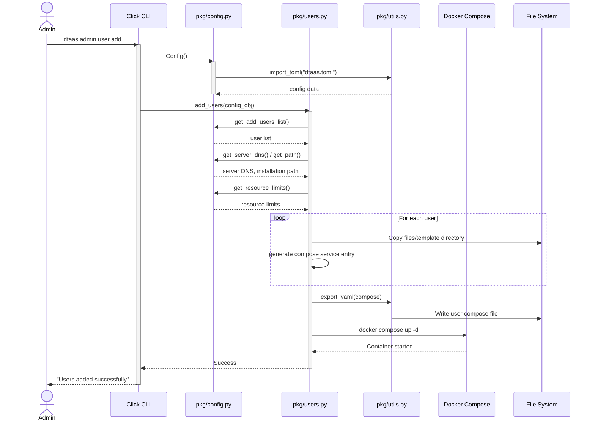

# Command Line Interface

The Command Line Interface (CLI) provides administrators with
programmatic control over the DTaaS platform. It covers the complete
deployment lifecycle: generating and validating configuration,
generating deployment projects for all supported scenarios, installing
and uninstalling deployments, updating certificates and configuration
in place, and provisioning and deprovisioning user accounts.

The user-facing guide is on the
[admin CLI page](../../admin/cli.md); the full command reference is in
the `cli/README.md` of the repository. This page documents the
internal structure for contributors.

## Command Surface

```text
dtaas
├── generate-project              # scaffold dtaas.toml + templates
├── generate-deployment --type X  # generate a deployment package
└── admin
    ├── config
    │   ├── generate              # write dtaas.toml + users.csv
    │   ├── validate              # check dtaas.toml, report all errors
    │   └── reconcile             # align state with configuration
    ├── install                   # docker compose up of a deployment
    ├── uninstall                 # tear down (optionally user files)
    ├── update                    # --certs and/or --config, in place
    └── user
        ├── add                   # provision user workspaces
        └── delete                # deprovision user workspaces
```

## Package Structure

The CLI package is organised as follows:

```text
cli/
├── src/                          # Application source code
│   ├── __init__.py               # Package initialization
│   ├── cmd.py                    # Click groups and command wiring
│   ├── cmd_user.py               # 'user add' / 'user delete' commands
│   ├── cmd_utils.py              # Shared command helpers
│   ├── cmd_deploy_utils.py       # Deployment command helpers
│   ├── pkg/                      # Implementation modules
│   │   ├── build.py              # Deployment package assembly
│   │   ├── certs.py              # Certificate handling
│   │   ├── cert_update.py        # In-place certificate rotation
│   │   ├── cert_validate.py      # Certificate pair validation
│   │   ├── config.py             # dtaas.toml parsing and access
│   │   ├── config_update.py      # In-place configuration re-apply
│   │   ├── config_validate.py    # Configuration validation rules
│   │   ├── constants.py          # Constant definitions
│   │   ├── deploy.py             # Install/uninstall orchestration
│   │   ├── deploy_config.py      # Scenario configuration mapping
│   │   ├── project.py            # Project/template generation
│   │   ├── registry.py           # Deployment registry
│   │   ├── state.py              # Installation state tracking
│   │   ├── users.py              # User lifecycle operations
│   │   ├── users_compose.py      # Per-user compose generation
│   │   ├── users_utils.py        # User file provisioning
│   │   ├── utils.py              # File I/O and utilities
│   │   └── validators.py         # Shared validation helpers
│   └── templates/                # dtaas.toml, users.csv, compose
│       └── ...                   # templates for user workspaces
├── tests/                        # Test suites and fixtures
├── pyproject.toml                # Poetry project configuration
└── README.md                     # Command reference
```

## Architecture and Design

The CLI is implemented as a Python package using the Click framework
for command parsing. Command definitions (`cmd*.py`) are kept separate
from implementation modules (`pkg/`); commands parse options, load and
validate configuration, and delegate to `pkg` functions. Docker
operations go through python-on-whales.

`dtaas.toml` is the single source of truth: every command reads it via
`pkg/config.py`, and `admin update --config` re-applies it to an
installed deployment rather than letting deployments drift from it.

### Key Modules

| Module               | Purpose                                        |
| :------------------- | :--------------------------------------------- |
| `cmd.py`             | Click groups; wires all commands together      |
| `cmd_user.py`        | User add/delete command definitions            |
| `pkg/config*.py`     | TOML parsing, validation, in-place updates     |
| `pkg/project.py`     | Template scaffolding (`generate-project`)      |
| `pkg/build.py`       | Deployment generation (`generate-deployment`)  |
| `pkg/deploy.py`      | Install/uninstall orchestration                |
| `pkg/cert_*.py`      | Certificate validation and rotation            |
| `pkg/users*.py`      | User workspace lifecycle                       |
| `pkg/state.py`       | Installation state tracking                    |
| `pkg/utils.py`       | YAML/TOML I/O, template substitution           |

## Sequence Diagram

The following diagram illustrates the user addition workflow:



## Error Handling Pattern

The CLI employs a consistent error handling strategy throughout the
codebase:

1. **Functions return errors as values**: Most functions return a
   tuple of `(result, error)` rather than raising exceptions
2. **Explicit error propagation**: Callers check for errors and
   propagate them up the call stack
3. **Click exceptions at boundaries**: At the CLI entry points, errors
   are converted to `click.ClickException` for user-friendly output

This pattern provides explicit control flow and facilitates testing by
making error paths explicit and testable.

## Resource Limits Configuration

The CLI supports configurable resource limits for user containers,
enabling administrators to control resource consumption per user and
reduce the possibility of a single user making excessive use of
limited computing resources. Limits are set in
`[common.resources]` of `dtaas.toml`. The `set_limits` flag toggles
enforcement; when it is `false`, user containers are created without
caps and the remaining fields are ignored:

| Parameter     | Description                      | Default       |
| :------------ | :------------------------------- | :------------ |
| `cpus`        | CPU core allocation              | `4`           |
| `mem_limit`   | Memory limit                     | `4G`          |
| `pids_limit`  | Maximum process count            | `4960`        |
| `shm_size`    | Shared memory size               | `512m`        |
