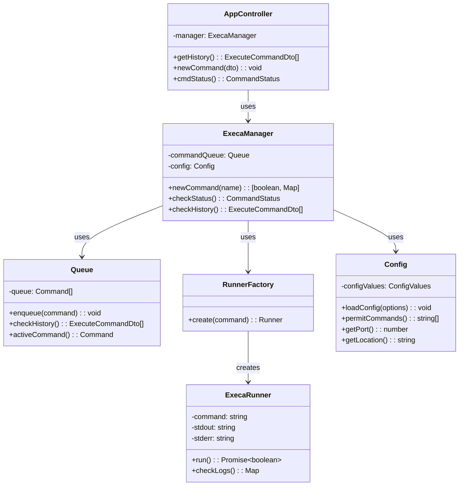

# Runner Microservice

The Runner microservice provides script execution capabilities for
digital twins within the DTaaS platform. This service accepts HTTP
requests to execute pre-configured commands and returns execution
status and logs to the caller.

## Package Structure

```text
servers/execution/runner/
├── src/                           # Application source code
│   ├── main.ts                    # Application entry point
│   ├── app.module.ts              # Root NestJS module
│   ├── app.controller.ts          # REST API controller
│   ├── execa-manager.service.ts   # Command execution manager
│   ├── execa-runner.ts            # Command runner implementation
│   ├── queue.service.ts           # Command queue service
│   ├── runner-factory.service.ts  # Runner instance factory
│   ├── validation.pipe.ts         # Request validation pipe
│   ├── config/                    # Configuration module
│   │   ├── commander.ts           # CLI argument parsing
│   │   ├── config.interface.ts    # Configuration interface
│   │   ├── configuration.service.ts  # Configuration service
│   │   └── util.ts                # Configuration utilities
│   ├── dto/                       # Data transfer objects
│   │   └── command.dto.ts         # Command request DTO
│   └── interfaces/                # Interface definitions
│       ├── command.interface.ts   # Command types
│       └── runner.interface.ts    # Runner interface
├── api/                           # API documentation
├── test/                          # Test suites
└── dist/                          # Compiled output
```

## Architecture and Design

The microservice is built using NestJS framework and employs the
`execa` library for command execution. The architecture implements
a command queue pattern for managing execution requests and a
factory pattern for creating runner instances.

### Core Components



## Key Components

### REST API Controller

The `AppController` exposes three endpoints:

| Endpoint        | Method | Purpose                                 |
| :-------------- | :----- | :-------------------------------------- |
| `/`             | POST   | Submit a new command for execution      |
| `/`             | GET    | Get status of the current command       |
| `/history`      | GET    | Retrieve execution history              |

### Execution Manager

The `ExecaManager` service orchestrates command execution:

1. Validates command against permitted commands list
2. Creates runner instance via factory
3. Queues command for execution
4. Returns execution logs and status

### Command Queue

The `Queue` service maintains execution history and tracks
the currently active command. Commands are stored with their
execution status (valid/invalid).

### Runner Interface

The `Runner` interface defines the contract for command executors:

```typescript
interface Runner {
  run(): Promise<boolean>;
  checkLogs(): Map<string, string>;
}
```

### Configuration

The service reads configuration from a YAML file specifying:

| Setting     | Purpose                                      |
| :---------- | :------------------------------------------- |
| `port`      | HTTP server port                             |
| `location`  | Base directory for executable scripts        |
| `commands`  | Whitelist of permitted command names         |

## Security Considerations

The runner implements a whitelist-based security model where only
commands explicitly listed in the configuration file may be executed.
This prevents arbitrary command execution attacks.
