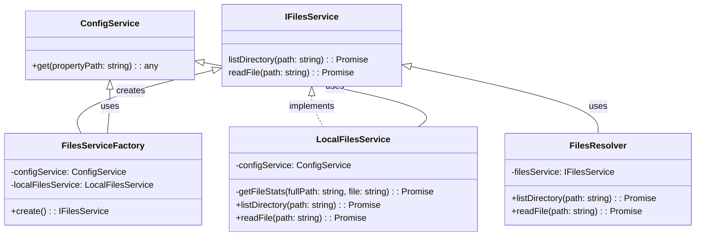
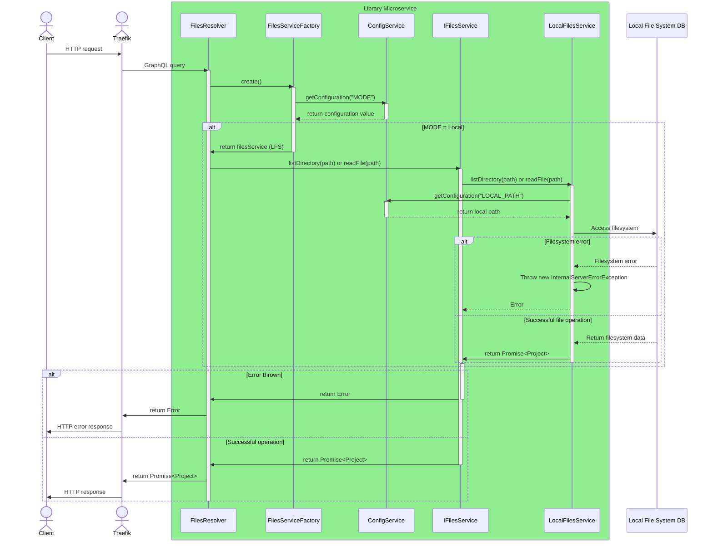

# Library Microservice

The Library Microservice exposes workspace files via two principal mechanisms:
(1) a GraphQL API and (2) an HTTP file server accessible from web browsers.
This service interfaces with the local file system
and GitLab to provide uniform GitLab-compliant API access to files.
The microservice serves as a critical component of the DTaaS platform,
enabling both human users and digital twins to access reusable assets
stored in the platform's library structure.

!!! warning
    This microservice is still under heavy development. It is still not
    a good replacement for file server we are using now.

## Architecture and Design

The microservice is built using NestJS framework with Apollo GraphQL.
The architecture employs the Strategy pattern via a factory service,
enabling support for multiple file storage backends (local filesystem, GitLab).
The GraphQL API provided by the library microservice shall be compliant
with the GitLab GraphQL service.

## Package Structure

```text
servers/lib/
├── src/                           # Application source code
│   ├── main.ts                    # Application entry point
│   ├── bootstrap.ts               # NestJS bootstrap configuration
│   ├── app.module.ts              # Root application module
│   ├── schema.gql                 # Auto-generated GraphQL schema
│   ├── types.ts                   # GraphQL type definitions
│   ├── config/                    # Configuration module
│   │   ├── config.module.ts       # Configuration DI module
│   │   ├── config.service.ts      # Configuration service
│   │   ├── config.interface.ts    # Configuration interface
│   │   ├── config.model.ts        # Configuration model
│   │   └── util.ts                # Configuration utilities
│   ├── files/                     # Files module (core functionality)
│   │   ├── files.module.ts        # Files DI module
│   │   ├── files.resolver.ts      # GraphQL resolver
│   │   ├── files-service.factory.ts  # Backend factory
│   │   ├── interfaces/            # Service interfaces
│   │   │   └── files.service.interface.ts
│   │   ├── local/                 # Local filesystem backend
│   │   │   ├── local-files.module.ts
│   │   │   └── local-files.service.ts
│   │   └── git/                   # GitLab backend
│   │       ├── git-files.module.ts
│   │       └── git-files.service.ts
│   ├── enums/                     # Enumeration definitions
│   │   └── config-mode.enum.ts    # Backend mode enum
│   └── cloudcmd/                  # CloudCmd file browser integration
├── test/                          # Test suites
└── dist/                          # Compiled output
```

## Key Components

### GraphQL Resolver

The `FilesResolver` class exposes two GraphQL queries:

| Query           | Purpose                                          |
| :-------------- | :----------------------------------------------- |
| `listDirectory` | Returns directory contents (files and folders)   |
| `readFile`      | Returns file content as raw text                 |

### File Service Interface

The `IFilesService` interface defines the contract for all file backends:

```typescript
interface IFilesService {
  listDirectory(path: string): Promise<Project>;
  readFile(path: string): Promise<Project>;
  getMode(): CONFIG_MODE;
  init(): Promise<any>;
}
```

### Backend Implementations

| Backend              | Purpose                                      |
| :------------------- | :------------------------------------------- |
| `LocalFilesService`  | Accesses files from local filesystem         |
| `GitFilesService`    | Accesses files from GitLab repository        |

### Factory Pattern

The `FilesServiceFactory` creates the appropriate backend service based
on configuration, enabling runtime selection of the storage backend.

## UML Diagrams

### Class Diagram



### Sequence Diagram


