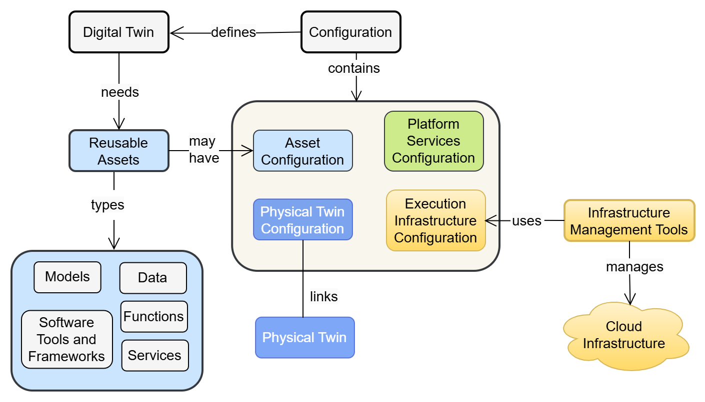
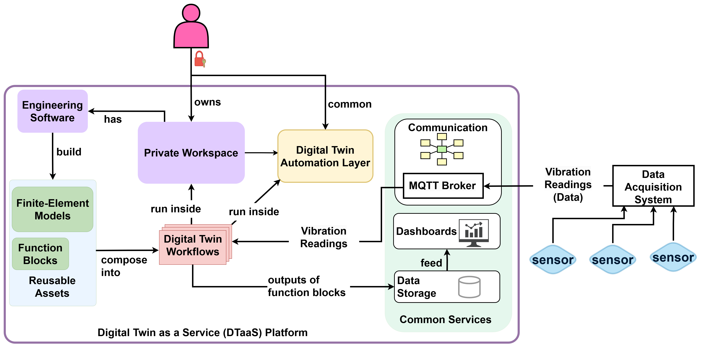
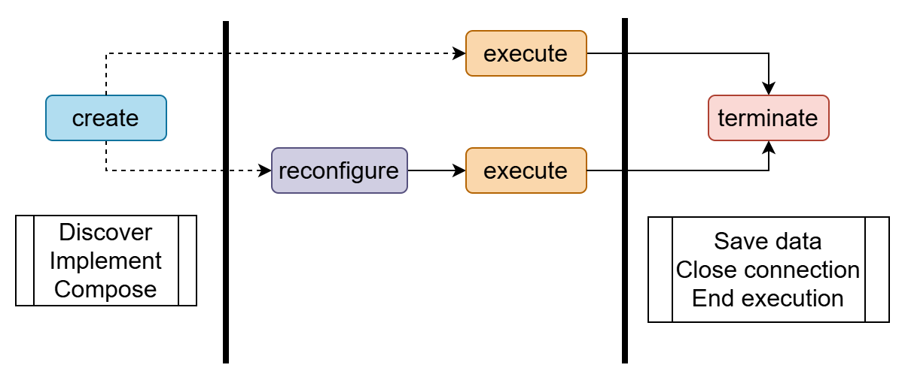
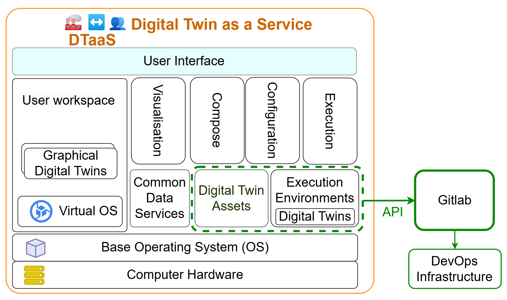
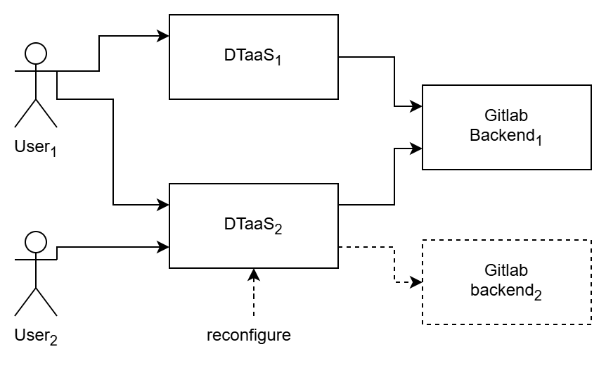
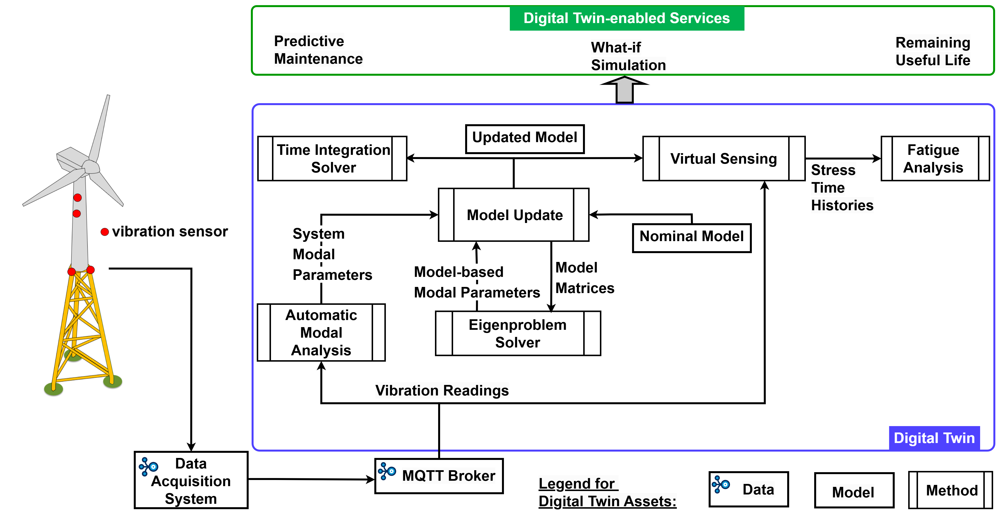

# :books: DTaaS Research Overview

This document summarises the research behind the DTaaS platform.
It is written for code contributors who need to understand the
design rationale, architectural decisions, and intended evolution
of the system.

## 1. :bulb: Introduction

A digital twin is a software representation of a physical asset that
stays connected to its real-world counterpart through data exchange,
enabling monitoring, analysis, and prediction throughout the asset
lifecycle. Digital twin platforms provide shared infrastructure for
creating, managing, and executing digital twins at scale.

DTaaS (Digital Twin as a Service) is an open-source platform that
treats digital twins as compositions of reusable assets rather than
monolithic applications. The platform organises assets into four
categories: data, models, functions (methods and scripts), and
services. Users compose these assets into digital twin configurations
that can be executed, monitored, and evolved independently.

The platform targets operability: creating, configuring, executing,
monitoring, and evolving twins in long-running environments. This
focus distinguishes DTaaS from simulation-only tools or pure modelling
frameworks.

## 2. :dart: Requirements

Eight core requirements drive the platform design:

1. **Author** — create and edit digital twin assets in isolated
   workspaces
1. **Consolidate** — combine assets from different sources into
   coherent twin configurations
1. **Configure** — set parameters for execution without modifying
   asset source code
1. **Execute** — run digital twin configurations on demand or
   continuously
1. **Explore** — browse available assets, twins, and execution results
1. **Save** — persist configurations, results, and intermediate state
1. **What-if Analysis** — evaluate alternative scenarios by varying
   parameters
1. **Collaborate** — share assets and twins across users and
   organisations

These requirements apply across domains. Validated case studies
include food fermentation process control and indoor climate
management for firefighter training, as well as structural health
monitoring of civil infrastructure.

## 3. :building_construction: System Architecture

The architecture decomposes the platform into four concern areas:

- **Gateway and authentication** — Traefik reverse proxy with
  OAuth 2.0 / OpenID Connect for route protection and user
  identity management
- **Execution management** — backend services that trigger, monitor,
  and stop digital twin runs via GitLab CI/CD pipelines
- **Reusable-asset handling** — library microservice backed by
  GitLab repositories, exposing asset discovery and retrieval APIs
- **Workspace isolation** — per-user JupyterLab containers with
  private file systems for authoring and running assets

This decomposition maps directly to the service split in the current
codebase: the React client handles user interaction, Traefik manages
routing and TLS, the library microservice wraps GitLab APIs for asset
management, and the execution service orchestrates pipeline triggers.

## 4. :bust_in_silhouette: User View

From a user perspective, DTaaS presents a single web interface that
aggregates workspace operations, asset browsing, digital twin
execution, and result exploration. Users interact with their own
isolated workspace while sharing assets through the common library.
The platform supports both class-level twin definitions (reusable
templates) and instance-level twins (bound to specific physical
assets).

## 5. :arrows_counterclockwise: Lifecycle-Driven Engineering

Lifecycle coverage is a first-class requirement, not an add-on. The
platform explicitly supports create, manage, execute, and stop phases
with iterative reconfiguration flows. This is why client and backend
contracts include both file management and execution tracking
concerns.

The lifecycle model acknowledges that digital twins evolve: models
are updated as physical assets change, new data sources are
integrated, and execution configurations are refined based on
operational experience.

## 6. :gear: DevOps and Federation

DTaaS integrates GitLab-backed DevOps automation as a core platform
capability. Repository structure, pipeline triggers, and OAuth
configuration are part of the platform contract, not just deployment
details. The platform supports two execution modes: continuous
(long-running services) and one-off (batch analysis jobs), both
managed through GitLab CI/CD pipelines.

The federation extension enables multiple DTaaS instances to
collaborate by discovering and reusing assets across organisational
boundaries. Federated digital twins can be organised as composites
(assembled from assets on different instances), fleets (coordinated
groups), or hierarchies (parent-child relationships).

## 7. :bridge_at_night: Application: Structural Health Monitoring

Structural health monitoring (SHM) of civil infrastructure
demonstrates DTaaS as an integration substrate for specialized
engineering workflows. In this application domain, digital twin
assets include sensor data acquisition modules (accelerometers,
distributed optical sensors), operational modal analysis functions,
finite element model updating procedures, and fatigue-based remaining
useful life estimation methods.

The SHM workflow composes these assets into a pipeline: sensor data
flows through modal analysis to extract structural properties, which
feed into model updating to calibrate a finite element model, which
in turn drives damage prognosis and remaining useful life estimation.
This demonstrates that DTaaS enables domain specialists to compose
complex workflows from reusable building blocks without replacing
their existing tools.

## :compass: Guidance for Contributors

When implementing or reviewing DTaaS changes:

1. Map the change to one of the concern areas above (architecture,
   lifecycle, DevOps/federation, domain application, monitoring).
1. Verify the change preserves intended lifecycle and composability
   behavior.
1. Check whether the change shifts architecture boundaries
   (gateway/auth, execution manager, reusable-asset layer,
   workspace isolation).
1. Document any intentional departure from design assumptions.

Common anti-patterns to avoid:

- Hard-coding one modeling or tooling workflow where the design
  expects heterogeneity.
- Collapsing layered responsibilities into UI code for short-term
  convenience.
- Treating DevOps and federation behavior as optional integration
  noise.

## :page_facing_up: References

The research behind DTaaS is documented in the following papers,
located in the `.research-papers/latex/` directory of this repository:

1. **Composable Digital Twins on Digital Twin as a Service Platform**
  — Defines the core platform architecture,
  asset model, lifecycle phases, and system requirements.
  (`Talasila, Prasad, et al., Composable digital twins on Digital Twin
  as a Service platform." Simulation 101.3 (2025): 287-311.`)
1. **Realising Digital Twins** — Positions DTaaS
   within the broader digital twin landscape with a comparative
   survey of existing frameworks, cloud deployment strategies, and
   fleet management concepts.
   (`Talasila, Prasad, et al. "Realising digital twins." The engineering of
   digital twins. Cham: Springer International Publishing, 2024. 225-256.`)
1. **Towards Federated Digital Twin Platforms**
   — Extends DTaaS for multi-instance
   federation, DevOps integration, and cross-organizational
   asset reuse.
   (`Frasheri, Mirgita, Prasad Talasila, and Vanessa Scherma. "Towards federated
   digital twin platforms." arXiv preprint arXiv:2505.04324 (2025).`)
1. **Structural Health Monitoring of Engineering Structures Using
   Digital Twins** — Demonstrates DTaaS for
   vibration-based SHM with modal analysis and model updating
   workflows.
   (`Talasila, P., et al. "Structural health monitoring of engineering
   structures using digital twins: A digital twin platform approach.
   "International Conference on Experimental Vibration Analysis for Civil
   Engineering Structures. Cham: Springer Nature Switzerland, 2025.`)
