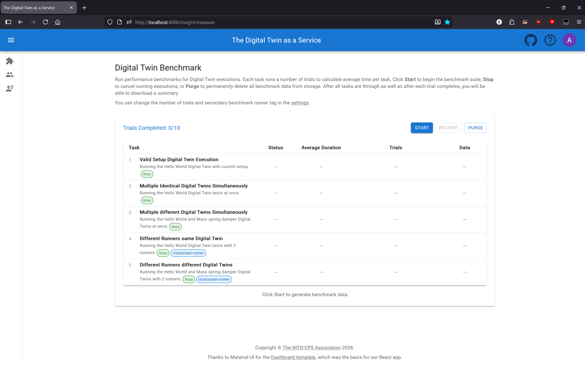

# Performance Benchmark

The DTaaS provides a built-in performance benchmark tool that allows developers
to measure the execution time of Digital Twin features. This is useful for
understanding performance characteristics and establishing baselines for
future optimization.

## Accessing the Benchmark Page

Navigate to `/admin/measure` to access the benchmark page. This page is
only accessible to authenticated users.



## Features

### Benchmark Tasks

The benchmark suite includes the following tasks that measure different
aspects of Digital Twin execution:

| Task | Description |
| ------ | ------------- |
| Valid Setup Digital Twin Execution | Runs the Hello World Digital Twin with current setup |
| Multiple Identical Digital Twins Simultaneously | Runs the Hello World Digital Twin twice at once |
| Multiple different Digital Twins Simultaneously | Runs the Hello World and Mass Spring Damper Digital Twins at once |
| Different Runners same Digital Twin | Runs the Hello World Digital Twin twice with 2 different runners |
| Different Runners different Digital Twins | Runs Hello World and Mass Spring Damper Digital Twins with 2 different runners |

### Configuration Options

- **Iterations**: Number of times each task is repeated to calculate average time
  (default: 3). Adjust this for more or fewer data points.
- **Secondary Runner Tag**: The runner tag used for multi-runner tests. The
  primary runner tag is configured in your account settings.

### Controls

- **Start**: Begin the benchmark suite from the first task
- **Stop**: Cancel all running executions (shows confirmation dialog)
- **Continue**: Resume a stopped benchmark from where it left off
- **Restart**: Discard all current results and start fresh (shows confirmation dialog)
- **Purge**: Clear all stored benchmark data from the database

## Understanding Results

### Status Values

| Status | Meaning |
| -------- | --------- |
| PENDING | Task has not started yet |
| RUNNING | Task is currently executing |
| SUCCESS | All trials completed successfully |
| FAILURE | One or more trials failed |
| STOPPED | Task was interrupted by user |

### Metrics

- **Average Duration**: Mean execution time across all trials for each task
- **Total Time**: Overall time for the complete benchmark suite (shown after completion)

## Data Storage

Benchmark measurements are stored separately from regular execution history
in your browser's IndexedDB. This allows you to:

- Keep measurements separate from normal DT execution logs
- Purge measurement data without affecting execution history
- Download results as JSON for further analysis

## Downloading Results

### Per-Task Download

After a task completes successfully, click "Download Task Results" in the
Data column to export that specific task's measurements as JSON.

### Full Results Download

After all tasks complete, a "Download JSON" link appears at the bottom
of the page to export the complete benchmark results.

### JSON Format

```JSON
{
  "totalTimeSeconds": 30,
  "tasks": [
    {
      "Task Name": "Run Simulation",
      "Description": "Executes a single Digital Twin",
      "Trials": [
        {
          "Time Start": "2026-01-29T16:54:00.000Z",
          "Time End": "2026-01-29T16:54:30.000Z",
          "Execution": [
            {
              "dtName": "hello-world",
              "pipelineId": 4567,
              "status": "success",
              "config": {
                "Branch name": "main",
                "Group name": "dtaas",
                "Common Library project name": "common",
                "DT directory": "dt",
                "Runner tag": "linux"
              }
            }
          ],
          "Status": "SUCCESS",
          "Error": null
        }
      ],
      "Time Start": "2026-01-29T16:54:00.000Z",
      "Time End": "2026-01-29T16:54:30.000Z",
      "Average Time (s)": 30,
      "Status": "SUCCESS"
    }
  ]
}
```

## Best Practices

1. **Run benchmarks during low-usage periods** to get consistent results
2. **Use multiple iterations** (3-5) for more reliable averages
3. **Ensure runners are available** before starting the benchmark
4. **Don't navigate away** during benchmark execution to avoid having to start over

## Troubleshooting

| Issue | Solution |
| ------- | ---------- |
| Task appears stuck, old pipelines appears | Reauthenticate the app by refreshing the tab |
| Tasks time out | Verify runners are online, uses the tag and are accessible |

## Related Documentation

- [Concurrent Execution](./concurrent-execution.md)
- [Execution Settings](./execution-settings.md)
- [Capabilities](./capabilities.md)
