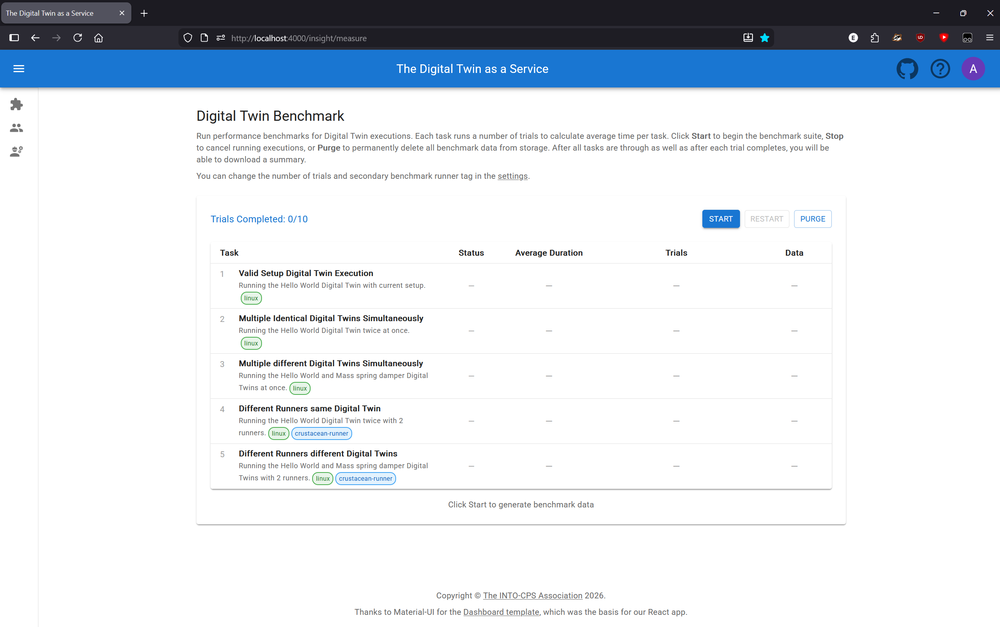
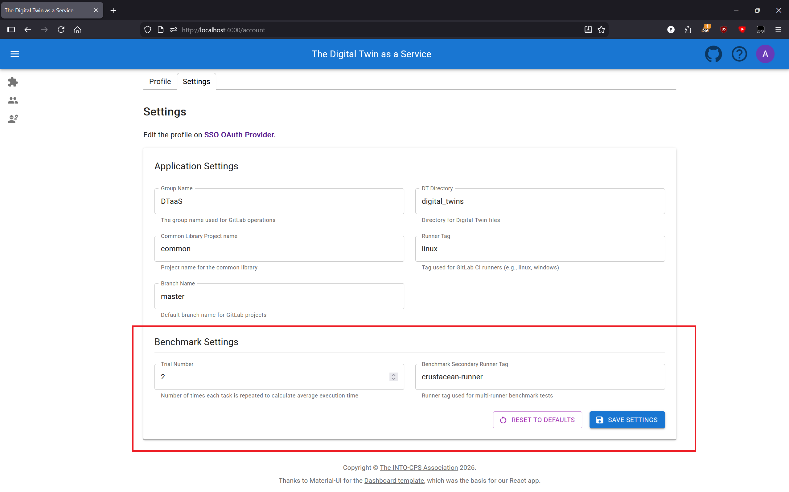
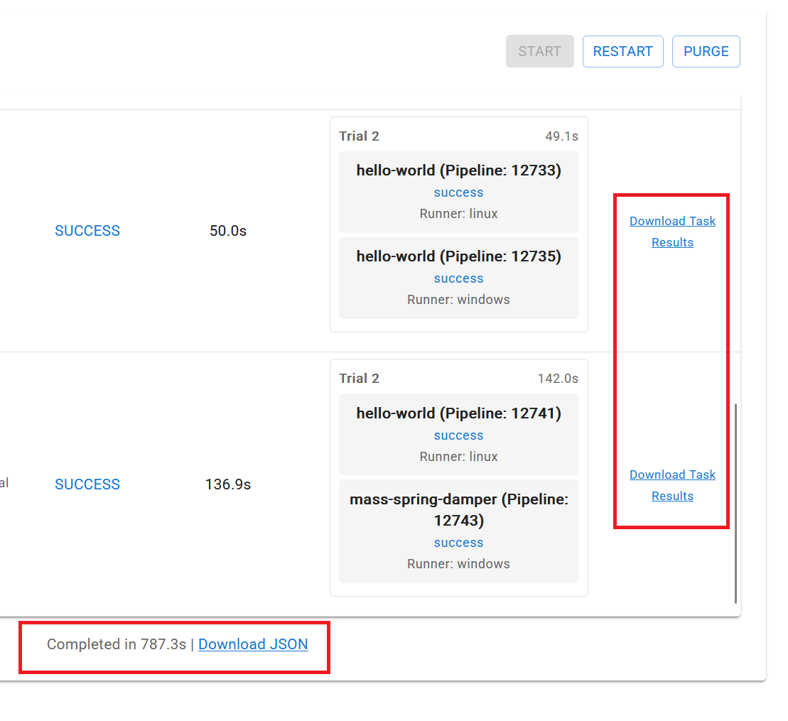

# Performance Benchmark

The DTaaS provides a built-in performance benchmark tool that allows developers
to measure the execution time of Digital Twin features. This is useful for
understanding performance characteristics and establishing baselines for
future optimization.

## Accessing the Benchmark Page

Navigate to `http://localhost:4000/insight/measure` or `https://foo.com/insight/measure`
to access the benchmark page. This page is only accessible to authenticated users.



## Features

### Benchmark Tasks

The benchmark suite includes the following tasks that measure different
aspects of Digital Twin execution:

| Task | Description |
| ------ | ------------- |
| Valid Setup Digital Twin Execution | Runs the Hello World Digital Twin with current setup |
| Multiple Identical Digital Twins Simultaneously | Runs the Hello World Digital Twin twice at once |
| Multiple different Digital Twins Simultaneously | Runs the Hello World and Mass Spring Damper Digital Twins at once |
| Different Runners same Digital Twin | Runs the Hello World Digital Twin twice with 2 different runners |
| Different Runners different Digital Twins | Runs Hello World and Mass Spring Damper Digital Twins with 2 different runners |


### Configuration Options

Configuration is managed in the **Benchmark Settings** section of
your account settings page.

- **Trial Number**: Number of times each task is repeated to calculate average
  execution time (default: 3). Adjust this for more or fewer data points.
- **Benchmark Secondary Runner Tag**: The runner tag used for multi-runner
  benchmark tests. The primary runner tag is configured separately in your
  account settings.

  

### Controls

- **Start**: Begin the benchmark suite from the first task
- **Stop**: Cancel all running executions (shows confirmation dialog)
- **Restart**: Discard all current results and start fresh (shows confirmation dialog)
- **Purge**: Clear all stored benchmark data from the database

## Understanding Results

### Status Values

| Status | Meaning |
| -------- | --------- |
| PENDING | Task has not started yet |
| RUNNING | Task is currently executing |
| SUCCESS | All trials completed successfully |
| FAILURE | One or more trials failed |
| STOPPED | Task was interrupted by user |

### Metrics

- **Average Duration**: Mean execution time across all trials for each task
- **Total Time**: Overall time for the complete benchmark suite (shown after completion)

### Benchmark Table Columns

The benchmark results table displays the following columns:

| Column | Description |
| ------ | ----------- |
| Task | Task number, name, and description |
| Status | Current execution status (NOT_STARTED, PENDING, RUNNING, SUCCESS, FAILURE, or STOPPED) |
| Average Duration | Mean execution time across all completed trials, displayed in seconds |
| Trials | Visual cards showing each trial's execution details and status. Each trial represents one iteration of the task |
| Data | Download button to export individual task results as JSON |

## Data Storage

Benchmark measurements are stored separately from regular execution history
in your browser's IndexedDB. This allows you to:

- Keep measurements separate from normal DT execution logs
- Purge measurement data without affecting execution history
- Download results as JSON for further analysis

## Downloading Results

### Per-Task Download

After a task completes successfully, click "Download Task Results" in the
Data column to export that specific task's measurements as JSON.

### Full Results Download

After all tasks complete, a "Download JSON" link appears at the bottom
of the page to export the complete benchmark results.

Both links shown below, from a completed benchmark run.



### JSON Format

The exported JSON contains detailed information about each task and its
trials. Each trial represents one iteration of a task, and contains an
`executions` array with the pipeline execution details. The configuration
is shared at the task level, while each execution includes its runner tag.

The exported JSON follows the structure below:

```json
{
  "totalTimeSeconds": number,
  "tasks": [
    {
      "Task Name": string,
      "Description": string,
      "config": {
        "Branch name": string,
        "Group name": string,
        "Common Library project name": string,
        "DT directory": string
      },
      "trials": [
        {
          "Time Start": "ISO8601 timestamp",
          "Time End": "ISO8601 timestamp",
          "Status": "PENDING | RUNNING | SUCCESS | FAILURE | STOPPED",
          "executions": [
            {
              "dtName": string,
              "pipelineId": number,
              "status": string,
              "Runner tag": string
            }
          ]
        }
      ],
      "Average Time (s)": number,
      "Status": string
    }
  ]
}
```

## Best Practices

1. **Run benchmarks during low-usage periods** to get consistent results
2. **Use multiple iterations** (3-5) for more reliable averages
3. **Ensure runners are available** before starting the benchmark
4. **Don't navigate away** during benchmark execution to avoid having to start over

## Troubleshooting

| Issue | Solution |
| ------- | ---------- |
| Task appears stuck, old pipelines appears | Reauthenticate the app by refreshing the tab |
| Tasks time out | Verify runners are online, uses the tag and are accessible |

## Related Documentation

- [Concurrent Execution](./concurrent-execution.md)
- [Execution Settings](./execution-settings.md)
- [Capabilities](./capabilities.md)
