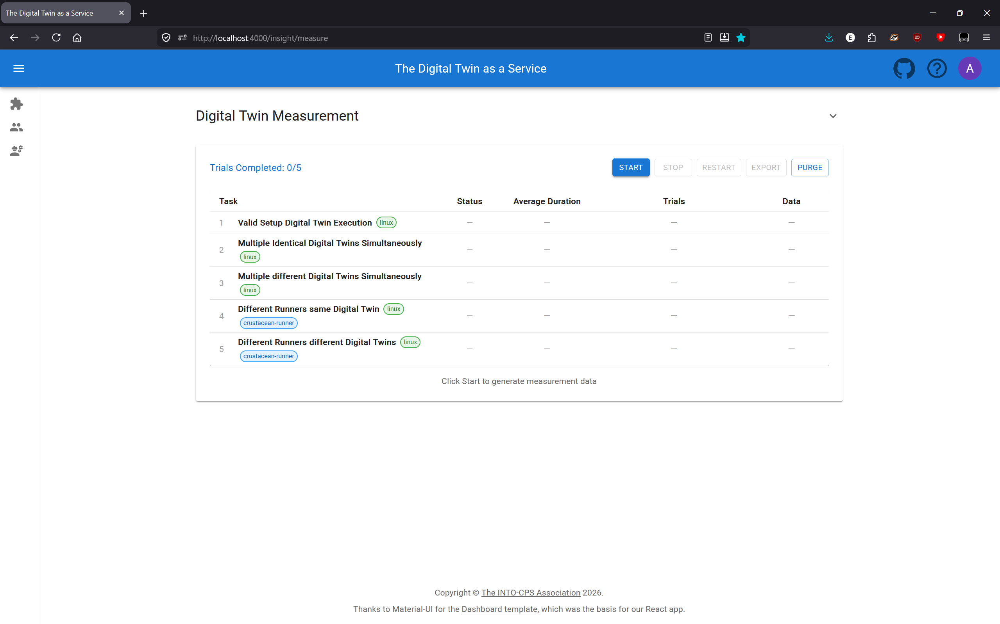
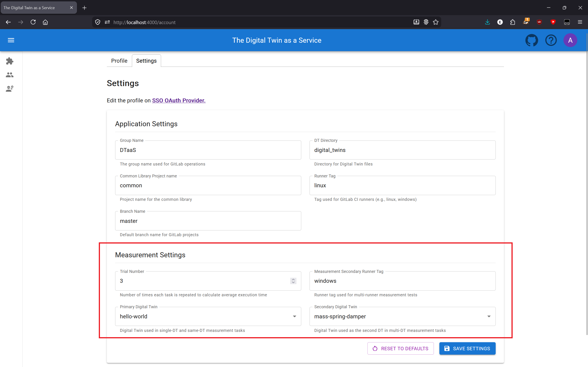

# Performance Measurement

The DTaaS provides a built-in performance measurement tool that allows developers
to measure the execution time of Digital Twin features. This is useful for
understanding performance characteristics and establishing baselines for
future optimization.

## Accessing the Measurement Page

Navigate to `http://localhost:4000/insight/measure` or `https://foo.com/insight/measure`
to access the measurement page. This page is only accessible to authenticated users.



## Features

### Measurement Tasks

The measurement suite includes the following tasks that measure different
aspects of Digital Twin execution:

| Task | Description |
| ------ | ------------- |
| Valid Setup Digital Twin Execution | Runs the primary Digital Twin with current setup |
| Multiple Identical Digital Twins Simultaneously | Runs the primary Digital Twin twice at once |
| Multiple different Digital Twins Simultaneously | Runs the primary and secondary Digital Twins at once |
| Different Runners same Digital Twin | Runs the primary Digital Twin twice with 2 different runners |
| Different Runners different Digital Twins | Runs the primary and secondary Digital Twins with 2 different runners |

By default, the primary Digital Twin is `hello-world` and the secondary
is `mass-spring-damper`. Both can be changed in the measurement settings.


### Configuration Options

Configuration is managed in the **Measurement Settings** section of
your account settings page.

- **Trial Number**: Number of times each task is repeated to calculate average
  execution time (default: 3). Adjust this for more or fewer data points.
- **Measurement Secondary Runner Tag**: The runner tag used for multi-runner
  measurement tests. The primary runner tag is configured separately in your
  account settings.
- **Primary Digital Twin Name**: The Digital Twin used in single-DT and
  same-DT measurement tasks (default: `hello-world`).
- **Secondary Digital Twin Name**: The Digital Twin used as the second DT
  in multi-DT measurement tasks (default: `mass-spring-damper`).

Note: the Primary and Secondary Digital Twin dropdowns need to load the
available Digital Twins the first time you visit the settings page in a
session. They will appear disabled until loading completes.

  

### Controls

- **Start**: Begin the measurement suite from the first task
- **Stop**: Cancel all running executions (shows confirmation dialog)
- **Restart**: Discard all current results and start fresh (shows confirmation dialog)
- **Export**: Download all measurement results as a JSON file
  (available when results exist)
- **Purge**: Clear all stored measurement data from the database

## Understanding Results

### Status Values

| Status | Meaning |
| -------- | --------- |
| PENDING | Task has not started yet |
| RUNNING | Task is currently executing |
| SUCCESS | All trials completed successfully |
| FAILURE | One or more trials failed |
| STOPPED | Task was interrupted by user |

### Metrics

- **Average Duration**: Mean execution time across all trials for each task
- **Total Time**: Overall time for the complete measurement suite (shown after completion)

### Measurement Table Columns

The measurement results table displays the following columns:

| Column | Description |
| ------ | ----------- |
| Task | Task number, name, and description |
| Status | Current execution status (NOT_STARTED, PENDING, RUNNING, SUCCESS, FAILURE, or STOPPED) |
| Average Duration | Mean execution time across all completed trials, displayed in seconds |
| Trials | Visual cards showing each trial's execution details and status. Each trial represents one iteration of the task |
| Data | Download button to export individual task results as JSON |

Each row in the table can be clicked to expand and show additional details
about the task's trial executions.

## Data Storage

Measurement data is stored separately from regular execution history
in your browser's IndexedDB. This allows you to:

- Keep measurements separate from normal DT execution logs
- Purge measurement data without affecting execution history
- Download results as JSON for further analysis

## Downloading Results

### Per-Task Download

After a task completes successfully, click "Download Task Results" in the
Data column to export that specific task's measurements as JSON.

### Full Results Download

Use the **Export** button in the controls toolbar to download all
measurement results as JSON. This button is available whenever results exist.

Both options shown below, from a completed measurement run.


### JSON Format

The exported JSON contains detailed information about each task and its
trials. Each trial represents one iteration of a task, and contains an
`executions` array with the pipeline execution details. The configuration
is shared at the task level, while each execution includes its runner tag.

The exported JSON follows the structure below:

```json
{
  "totalTimeSeconds": number,
  "tasks": [
    {
      "Task Name": string,
      "Description": string,
      "config": {
        "Branch name": string,
        "Group name": string,
        "Common Library project name": string,
        "DT directory": string
      },
      "trials": [
        {
          "Time Start": "ISO8601 timestamp",
          "Time End": "ISO8601 timestamp",
          "Status": "PENDING | RUNNING | SUCCESS | FAILURE | STOPPED",
          "executions": [
            {
              "dtName": string,
              "pipelineId": number,
              "status": string,
              "Runner tag": string
            }
          ]
        }
      ],
      "Average Time (s)": number,
      "Status": string
    }
  ]
}
```

## Timing Behavior

The measurement system uses deliberate delays of 750ms to avoid
overloading the GitLab instance with simultaneous requests:

- **Between trials**: A 750ms delay is applied before each trial
  *except the first*. Trial 0 starts immediately; trials 1, 2, … each
  wait 750ms after the previous trial completes.
- **Between executions within a trial**: When a task runs multiple
  Digital Twins (e.g. "Multiple different Digital Twins Simultaneously"),
  each execution is staggered by 750ms. The first execution starts
  immediately, the second after 750ms, the third after 1500ms, and so on.

When interpreting the **Average Duration** of a task, keep in mind that
the stagger delay between executions is included in the measured time.
The delay between trials is *not* included, since each trial's timer
starts after its delay.

## Best Practices

1. **Run measurements during low-usage periods** to get consistent results
2. **Use multiple iterations** (3-5) for more reliable averages
3. **Ensure runners are available** before starting the measurement
4. **You can navigate away** from the measurement page while it is running —
   execution continues in the background. However, **changing the URL,
   refreshing, or closing the tab will stop the measurement**. Notifications
   will let you know when the measurement completes or is stopped.

## Troubleshooting

| Issue | Solution |
| ------- | ---------- |
| Task appears stuck, old pipelines appears | Reauthenticate the app by refreshing the tab |
| Tasks time out | Verify runners are online, uses the tag and are accessible |

## Related Documentation

- [Concurrent Execution](./concurrent-execution.md)
- [Execution Settings](./execution-settings.md)
- [Capabilities](./capabilities.md)
